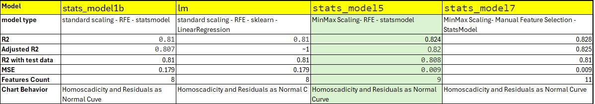

# Project Name - Bike Sharing Linear Regression Model

This repository contains the code & subjective question and answer for a Bike Sharing Linear Regression Model assignment. 

## Problem Statement

### Bike Sharing Assignment
A bike-sharing system is a service in which bikes are made available for shared use to individuals on a short term basis for a price or free. Many bike share systems allow people to borrow a bike from a "dock" which is usually computer-controlled wherein the user enters the payment information, and the system unlocks it. This bike can then be returned to another dock belonging to the same system.

A US bike-sharing provider BoomBikes has recently suffered considerable dips in their revenues due to the ongoing Corona pandemic. The company is finding it very difficult to sustain in the current market scenario. So, it has decided to come up with a mindful business plan to be able to accelerate its revenue as soon as the ongoing lockdown comes to an end, and the economy restores to a healthy state. 

In such an attempt, BoomBikes aspires to understand the demand for shared bikes among the people after this ongoing quarantine situation ends across the nation due to Covid-19. They have planned this to prepare themselves to cater to the people's needs once the situation gets better all around and stand out from other service providers and make huge profits.

They have contracted a consulting company to understand the factors on which the demand for these shared bikes depends. Specifically, they want to understand the factors affecting the demand for these shared bikes in the American market. The company wants to know:

- Which variables are significant in predicting the demand for shared bikes.
- How well those variables describe the bike demands

Based on various meteorological surveys and people's styles, the service provider firm has gathered a large dataset on daily bike demands across the American market based on some factors. 

## Table of Contents
* [General Info](#general-information)
* [Technologies Used](#technologies-used)
* [Conclusions](#conclusions)
* [Acknowledgements](#acknowledgements)

<!-- You can include any other section that is pertinent to your problem -->

## General Information
Objective of this assignment is to understand the business problem and build linear regression model and it will be used by management accordingly manipulate the business strategy to meet the demand levels and meet the customer's expectations. Further, the model will be a good way for management to understand the demand dynamics of a new market

## Data Understanding
The dataset contains bike sharing data of 2018 and 2019 for Boombikes

## Approach & Conclusions

### Exploratory Data Analysis - Learning Data

- Model building exercise was carried out by performing exploratory data analyis to understand the data and the pattern. Any issue with data was addressed accordingly. relationship among the predictor variables and its correlation with target variable was understood with help of pairplots and heatmap. Some of the variables like weekday/working day & temp/atemp,  were identified at redundant as they had an correlation with each other. Also the casual and registered are directly the porttion of "cnt" target variable and hence it was dropped.
 

### Preprocessing of Data
- Once the predictor variables were identified, the data set was categorized into Numerical and Categorical columns. For Categorical fields, dummy variables were created. Some of the Categorical variables had numerical value 1,2,3.. to represent different category, but those numbers didnt carry any numerical significance. Actual Category values (ex Season..) were brought in and later dummy variables were used to convert to binary values. Didnt use month value here as Season would represent the month. 
 

### Scaling of the data

- Scaling was done to bring all the numerical variables to same scale. <b>Categorical Variables werent scaled as they were already having binary values</b>. Both of type of scaling were done, Standardization and MinMax scaling were used. Different models were built to understand the impact of scaling. For Manual selection of predictor variables, MinMax scaling was used. One the explict point to note "y" -"Target Variable" also needs to be scaled. Scaling was performed after splitting the data in to <b> TEST and TRAINING sets </b>. Scaling could have performed before splitting into test and training set, which is an ideal practice, to understand impact of not scaling this method was performed. 

##### key learnings
- Scale only Numerical Variables
- Scale Target Value also. It is better to scale whole dataframe excluding categorical variable & then perform train-test split.
- Both MinMax and Standardization gave similar model variance explainability and co-efficients.
- Fit & Transform Training Values & <b>Only Fit Test Values </b>. 

### Feature Selection  
- Both Automated RFE, and Manual Predictor selection were performed. For manual selection, MinMax Scaling was considered. Multiple models were built, analysed p value, VIF to select best predictor variables to build model. for RFE, coulum count was considered as 10. For manual model, variables with high correlation was dropped and then model was built, <b>p values </b> were determined, dropped the variables which had p-values more than 0.05 and then VIF was caluclated to check if any predictor field variance is determined by other predictor fields.

### Building Model  
- For model building, these combination of Scaling, Feature Selection and Models were considered.
  - Standard Scaling - RFE - Stats Model. Multiple models were built to find best coffecients and R2 with low VIF
  - Standard Scaling -RFE - Linear Regression Model. Both models coffeicients were compared.
  - MinMax Scaling - RFE - Stats Model
  - MinMax Scaling - Manual Selection - Stats Model

- For all these models, <b> R2, Adjusted R2, & MSE </b> were calucated. For the final Models in each combination, prediction were done aganinst test data. Outputs were plotted to verify the assumptions of linear regression.
- Assumptions of Linear Regression
  - Linear Relationship between Target and Predictor Variable
  - Homoscedasticity
  - Residuals are normally distributed with mean around 0
  - No Relation between Residuals

### Model comparison

#### <b>stats_model5</b> is the better model among 4 models as it explains 82% of variance with test data (stable when compared to training data), all coefficients are significant and very less or no collinearity between features. MSE is lesser than model built using standard scaler hence this was chosen

The detailed analysis is available in the notebook

<!-- You don't have to answer all the questions - just the ones relevant to your project. -->

## Technologies Used
- python 3.11.5
- pandas -2.0.3
- numpy -1.24.3
- matplotlib -3.7.2
- seaborn -0.12.2
- statsmodel 0.14
- sklearn 1.4.2
- jupyter notebook -6.5.4

<!-- As the libraries versions keep on changing, it is recommended to mention the version of library used in this project -->

## Acknowledgements

- This case study was carried out as part of Upgrad-IIITB AI-ML Executive PG Program
- References
    - Upgrad Course - https//learn.upgrad.com
    - YouTube Links - https://www.youtube.com/@codebasics
    

## Contact
- Created by [@kondajji]()

<!-- Optional -->
<!-- ## License -->
<!-- This project is open source and available under the [... License](). -->

<!-- You don't have to include all sections - just the one's relevant to your project -->
